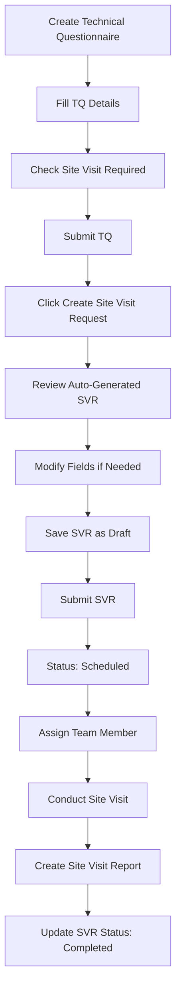
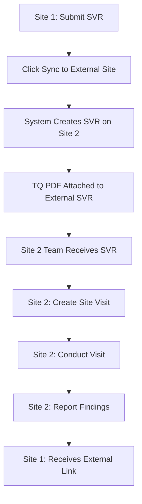

# Site Visit Request User Guide

## Table of Contents
1. [Overview](#overview)
2. [Creating Site Visit Requests](#creating-site-visit-requests)
3. [Creating SVR from Technical Questionnaire](#creating-svr-from-technical-questionnaire)
4. [Site Visit Request Fields](#site-visit-request-fields)
5. [External Site Integration](#external-site-integration)
6. [Workflow Process](#workflow-process)
7. [Troubleshooting](#troubleshooting)

---

## Overview

The Site Visit Request (SVR) system is designed to manage and coordinate technical site visits for wastewater treatment plant (WWTP) assessments. The system supports both manual creation and automatic generation from Technical Questionnaires (TQ), with advanced multi-site integration capabilities.

### Key Features
- **Manual SVR Creation**: Create site visit requests manually for any project
- **TQ Integration**: Automatically generate SVRs from submitted Technical Questionnaires
- **Multi-Site Sync**: Sync SVRs to external sites for distributed teams
- **Smart Field Population**: Intelligent field population based on TQ data
- **Comprehensive Tracking**: Full audit trail and status tracking

---

## Creating Site Visit Requests

### Manual Creation

1. **Navigate to Site Visit Request**
   - Go to `WT Operations` → `Site Visit Request`
   - Click `New` to create a new request

2. **Fill Basic Information**
   - **Lead**: Select the lead/company (required)
   - **Opportunity**: Link to related opportunity (optional)
   - **Site Visit Date**: Set the planned visit date (required)
   - **Status**: Automatically set to "Open"

3. **Complete Visit Details**
   - **Visit Type**: Choose from predefined options
   - **Priority**: Set priority level (Low, Medium, High, Urgent)
   - **Assigned To**: Assign to team member
   - **Contact Information**: Fill contact details

4. **Add Location Information**
   - **Site Address**: Enter complete site address
   - **City, State**: Location details
   - **Coordinates**: Latitude and longitude (optional)
   - **Maps Link**: Google Maps or other mapping service link

5. **Define Requirements**
   - **Visit Purpose**: Describe the purpose of the visit
   - **Special Requirements**: Any specific needs or constraints
   - **Equipment Needed**: List required equipment
   - **Estimated Duration**: Expected visit duration

6. **Set Follow-up**
   - **Follow-up Required**: Check if follow-up is needed
   - **Follow-up Date**: Set follow-up date if required
   - **Follow-up Notes**: Additional notes for follow-up

7. **Save and Submit**
   - Click `Save` to create as draft
   - Click `Submit` to finalize the request

---

## Creating SVR from Technical Questionnaire

### Prerequisites
- Technical Questionnaire must be **submitted** (not draft)
- `Site Visit Required` checkbox must be checked in the TQ

### Step-by-Step Process

#### Step 1: Submit Technical Questionnaire
1. Complete all required fields in the Technical Questionnaire
2. Ensure `Site Visit Required` is checked
3. Click `Submit` to finalize the TQ

#### Step 2: Create Site Visit Request
1. Open the submitted Technical Questionnaire
2. Look for the **"Create Site Visit Request"** button (appears only for submitted TQs)
3. Click the button to generate the SVR

#### Step 3: Review Generated SVR
The system automatically creates a comprehensive SVR with:

**Smart Field Population:**
- **Visit Type**: Determined by TQ data
  - `Follow-up Visit`: For WWTP upgrades
  - `Technical Survey`: For Industrial/Oil & Gas/Slaughterhouse
  - `Initial Assessment`: When sample collection required
  - `Technical Survey`: Default for other cases

- **Priority**: Calculated using intelligent scoring
  - **Urgent**: Score ≥4 (Large capacity + complex type + samples)
  - **High**: Score ≥2 (Medium complexity)
  - **Medium**: Score ≥1 (Basic requirements)
  - **Low**: Score <1 (Simple cases)

- **Visit Purpose**: Detailed description including:
  - Generator type context
  - Capacity information
  - Special requirements (sampling, survey)

- **Special Requirements**: Comprehensive list including:
  - Treatment capacity and footprint
  - Location details
  - Generator-specific requirements
  - Existing equipment assessment
  - Site conditions
  - Flow characteristics
  - Multiple stream handling

- **Equipment List**: Dynamic equipment based on needs:
  - **Basic**: Measuring tape, Camera, Notebook, Safety equipment
  - **Sample Collection**: Water sampling bottles, pH meter, Turbidity meter, etc.
  - **Generator-Specific**: 
    - Industrial: Chemical test strips, Conductivity meter
    - Oil & Gas: Oil detection kit, Hydrocarbon analyzer
    - Slaughterhouse: BOD test kit, Organic load analyzer
  - **Additional**: Area measurement tools, Flow devices, Multiple sampling setup

- **Duration Estimate**: Smart calculation based on:
  - Base: 2 hours
  - Sample collection: +1 hour
  - Complex types: +1-2 hours
  - Multiple streams: +0.5 hours per stream
  - Large capacity: +1 hour
  - Site survey: +1 hour

#### Step 4: Complete and Review
1. Review all auto-populated fields
2. Modify any fields as needed
3. Add additional information if required
4. Save the SVR as draft

#### Step 5: Submit SVR
1. Click `Submit` to finalize the SVR
2. Status changes to "Scheduled"
3. SVR is ready for team assignment

---

## Site Visit Request Fields

### Basic Information
| Field | Description | Required |
|-------|-------------|----------|
| Lead | Company/lead for the visit | Yes |
| Opportunity | Related sales opportunity | No |
| Technical Questionnaire | Link to source TQ | Auto-set |
| Site Visit Date | Planned visit date | Yes |
| Status | Current status | Auto-set |

### Visit Details
| Field | Description | Options |
|-------|-------------|---------|
| Visit Type | Type of visit | Initial Assessment, Technical Survey, Follow-up Visit, Emergency Visit, Routine Inspection |
| Priority | Visit priority | Low, Medium, High, Urgent |
| Assigned To | Team member assigned | Employee selection |
| Contact Person | Site contact | Text field |
| Contact Number | Phone number | Text field |
| Email | Contact email | Email field |

### Location Information
| Field | Description |
|-------|-------------|
| Site Address | Complete site address |
| City | City name |
| State | State/province |
| Latitude and Longitude | GPS coordinates |
| Maps Location Link | Google Maps or other link |

### Requirements
| Field | Description |
|-------|-------------|
| Visit Purpose | Detailed purpose description |
| Special Requirements | Specific needs and constraints |
| Equipment Needed | Required equipment list |
| Estimated Duration | Expected visit time |
| Preferred Time Slot | Preferred visit time |

### Follow-up
| Field | Description |
|-------|-------------|
| Follow-up Required | Whether follow-up is needed |
| Follow-up Date | Follow-up date if required |
| Follow-up Notes | Additional follow-up information |

---

## External Site Integration

### Overview
The system supports syncing Site Visit Requests to external sites for distributed teams and multi-site operations.

### Setup
1. **Configure External Site Settings**
   - Go to `WT Operations` → `External Site Settings`
   - Create new external site configuration
   - Enter site URL, API key, and API secret
   - Test connection to verify setup

2. **Manual Sync Process**
   - Open any Site Visit Request
   - Click **"Sync to External Site"** button
   - Confirm the sync operation
   - System creates identical SVR on external site
   - TQ PDF is automatically attached to external SVR

### Sync Status Tracking
| Status | Description |
|--------|-------------|
| Pending | Not yet synced |
| Synced | Successfully synced to external site |
| Failed | Sync failed (check error message) |

### External Site Fields
- **External Request Name**: Name of SVR on external site
- **External Request URL**: Direct link to external SVR
- **External Sync Status**: Current sync status
- **External Sync Error**: Error details if sync failed

---

## Workflow Process

### Complete Workflow

### Multi-Site Workflow

---

## Troubleshooting

### Common Issues

#### 1. "Create Site Visit Request" Button Not Visible
**Problem**: Button doesn't appear on TQ
**Solutions**:
- Ensure TQ is submitted (not draft)
- Check that `Site Visit Required` is checked
- Refresh the page

#### 2. SVR Creation Error
**Problem**: Error when creating SVR from TQ
**Solutions**:
- Verify TQ is submitted
- Check all required TQ fields are filled
- Ensure lead is selected in TQ

#### 3. Sync to External Site Failed
**Problem**: External sync fails
**Solutions**:
- Check External Site Settings configuration
- Verify API credentials are correct
- Test connection in External Site Settings
- Check network connectivity

#### 4. Fields Not Auto-Populated
**Problem**: SVR fields are empty after creation
**Solutions**:
- Ensure TQ has sufficient data
- Check TQ field mappings
- Verify TQ is properly submitted

### Error Messages

| Error Message | Cause | Solution |
|---------------|-------|----------|
| "Technical Questionnaire must be submitted" | TQ is in draft status | Submit the TQ first |
| "Not allowed to change Local Site Visit Request" | Trying to modify submitted TQ | Use the sync button instead |
| "No external site settings configured" | External site not set up | Configure External Site Settings |
| "Connection failed" | API credentials incorrect | Check and update API credentials |

### Best Practices

1. **Always submit TQ before creating SVR**
2. **Review auto-generated fields before submitting SVR**
3. **Test external site connection before syncing**
4. **Keep TQ data complete and accurate**
5. **Use descriptive visit purposes**
6. **Set realistic visit durations**
7. **Include all necessary equipment**
8. **Document special requirements clearly**

---

## Support

For additional support or questions about the Site Visit Request system:

1. **Check this documentation** for common solutions
2. **Review error messages** for specific guidance
3. **Contact system administrator** for technical issues
4. **Submit feature requests** through the appropriate channels

---

*Last Updated: [Current Date]*
*Version: 1.0*
