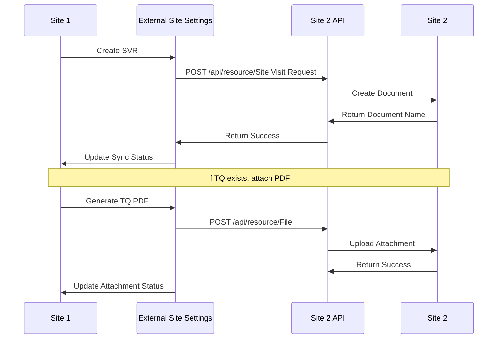

# Site 1 to Site 2 Integration

## Overview

This document describes the integration flow from Site 1 to Site 2, including data synchronization, field mappings, and error handling for Site Visit Requests, Technical Proposals, and file attachments.

## Integration Sequence



## Site Visit Request Sync

### Trigger Points
- **Automatic**: When Site Visit Request is submitted
- **Manual**: Using "Push to External Site" button
- **Retry**: Using "Retry Push" button for failed operations

### Data Flow
1. **Document Creation**: Site Visit Request created on Site 1
2. **Sync Trigger**: Automatic or manual sync trigger
3. **Data Transformation**: Transform data for Site 2 format
4. **API Call**: Send data to Site 2 via REST API
5. **Status Update**: Update sync status on Site 1
6. **Error Handling**: Handle any sync errors

### Field Mapping Table

| Site 1 Field | Site 2 Field | Notes/Transform |
|--------------|---------------|-----------------|
| `lead` | `lead` | Direct mapping |
| `opportunity` | `opportunity` | Direct mapping |
| `site_visit_date` | `site_visit_date` | Date format conversion |
| `status` | `status` | Direct mapping |
| `source_document` | `source_document` | Set to Site 1 SVR name |
| `source_doctype` | `source_doctype` | Set to "Site Visit Request" |
| `notes` | `notes` | Add Site 1 reference |
| `priority` | `priority` | Direct mapping |
| `visit_type` | `visit_type` | Direct mapping |
| `visit_purpose` | `visit_purpose` | Direct mapping |
| `special_requirements` | `special_requirements` | Direct mapping |
| `equipment_needed` | `equipment_needed` | Direct mapping |
| `estimated_duration` | `estimated_duration` | Direct mapping |
| `follow_up_required` | `follow_up_required` | Direct mapping |

### API Payload Example

```json
{
  "doctype": "Site Visit Request",
  "lead": "LEAD-2024-00001",
  "opportunity": "OPP-2024-00001",
  "site_visit_date": "2024-01-15",
  "status": "Open",
  "source_document": "SVR-2024-00001",
  "source_doctype": "Site Visit Request",
  "notes": "Synced from Site 1 - Original SVR: SVR-2024-00001",
  "priority": "High",
  "visit_type": "Technical Survey",
  "visit_purpose": "WWTP Technical Assessment for Industrial wastewater",
  "special_requirements": "Treatment Capacity: 500 m³/day; Available Footprint: 200 sqm",
  "equipment_needed": "Measuring tape, Camera, Notebook, Safety equipment",
  "estimated_duration": "3-4 hours",
  "follow_up_required": 1
}
```

## Technical Proposal Sync

### Trigger Points
- **Manual**: Using "Sync to External Site" button
- **Automatic**: When Technical Proposal is submitted (if configured)

### Data Flow
1. **Document Selection**: Technical Proposal selected for sync
2. **Data Transformation**: Transform data for Site 2 format
3. **API Call**: Send data to Site 2 via REST API
4. **Status Update**: Update sync status on Site 1
5. **Error Handling**: Handle any sync errors

### Field Mapping Table

| Site 1 Field | Site 2 Field | Notes/Transform |
|--------------|---------------|-----------------|
| `lead` | `lead` | Direct mapping |
| `opportunity` | `opportunity` | Direct mapping |
| `wwtp_technical_questionnaire` | `wwtp_technical_questionnaire` | Direct mapping |
| `site_visit` | `site_visit` | Direct mapping |
| `water_sample` | `water_sample` | Direct mapping |
| `proposal_date` | `proposal_date` | Date format conversion |
| `valid_until` | `valid_until` | Date format conversion |
| `prepared_by` | `prepared_by` | Direct mapping |
| `technical_manager` | `technical_manager` | Direct mapping |
| `project_title` | `project_title` | Direct mapping |
| `project_description` | `project_description` | Direct mapping |
| `wastewater_generator_type` | `wastewater_generator_type` | Direct mapping |
| `design_capacity` | `design_capacity` | Direct mapping |
| `current_capacity` | `current_capacity` | Direct mapping |
| `treatment_technology` | `treatment_technology` | Direct mapping |
| `process_description` | `process_description` | Direct mapping |
| `treatment_stages` | `treatment_stages` | Direct mapping |
| `civil_requirements` | `civil_requirements` | Direct mapping |
| `site_preparation_needs` | `site_preparation_needs` | Direct mapping |
| `utility_connections` | `utility_connections` | Direct mapping |
| `operation_hours` | `operation_hours` | Direct mapping |
| `maintenance_requirements` | `maintenance_requirements` | Direct mapping |
| `chemical_consumption` | `chemical_consumption` | Direct mapping |
| `energy_consumption` | `energy_consumption` | Direct mapping |
| `environmental_permits_required` | `environmental_permits_required` | Direct mapping |
| `discharge_permit_status` | `discharge_permit_status` | Direct mapping |
| `environmental_monitoring` | `environmental_monitoring` | Direct mapping |
| `equipment_cost` | `equipment_cost` | Direct mapping |
| `civil_works_cost` | `civil_works_cost` | Direct mapping |
| `electrical_cost` | `electrical_cost` | Direct mapping |
| `total_project_cost` | `total_project_cost` | Direct mapping |
| `design_period` | `design_period` | Direct mapping |
| `procurement_period` | `procurement_period` | Direct mapping |
| `construction_period` | `construction_period` | Direct mapping |
| `commissioning_period` | `commissioning_period` | Direct mapping |
| `total_implementation_time` | `total_implementation_time` | Direct mapping |
| `technical_risks` | `technical_risks` | Direct mapping |
| `environmental_risks` | `environmental_risks` | Direct mapping |
| `mitigation_strategies` | `mitigation_strategies` | Direct mapping |
| `technical_recommendations` | `technical_recommendations` | Direct mapping |
| `next_steps` | `next_steps` | Direct mapping |
| `follow_up_required` | `follow_up_required` | Direct mapping |

## File Attachment Sync

### TQ PDF Attachment
When a Site Visit Request is synced and has a linked Technical Questionnaire, the system automatically generates and attaches a PDF of the Technical Questionnaire to the external Site Visit Request.

### Process Flow
1. **PDF Generation**: Generate PDF from Technical Questionnaire
2. **Base64 Encoding**: Convert PDF to base64 format
3. **File Upload**: Upload file to Site 2 via File API
4. **Attachment Link**: Link file to external Site Visit Request
5. **Status Update**: Update attachment status

### File Upload Payload

```json
{
  "doctype": "File",
  "attached_to_doctype": "Site Visit Request",
  "attached_to_name": "SVR-2024-00001",
  "file_name": "WWTP_TQ_WWT-TQ-2024-00001.pdf",
  "is_private": 1,
  "content": "base64_encoded_pdf_content"
}
```

## Error Handling

### HTTP Status Codes
- **200**: Success
- **400**: Bad Request (validation errors)
- **401**: Unauthorized (invalid credentials)
- **403**: Forbidden (insufficient permissions)
- **404**: Not Found (resource not found)
- **500**: Internal Server Error (server error)

### Error Response Format

```json
{
  "message": "Error description",
  "exc_type": "ValidationError",
  "exc": "Detailed error information"
}
```

### Error Handling Process
1. **Error Detection**: Detect HTTP error or validation error
2. **Error Logging**: Log error details
3. **Status Update**: Update sync status to "Failed"
4. **Error Message**: Store error message in `external_sync_error`
5. **Retry Option**: Provide retry option for user

### Common Error Scenarios

#### Authentication Errors
- **Cause**: Invalid API Key or Secret
- **Solution**: Verify credentials in External Site Settings
- **Action**: Test connection and update credentials

#### Validation Errors
- **Cause**: Field validation failures on Site 2
- **Solution**: Check field mappings and required fields
- **Action**: Review validation rules on Site 2

#### Network Errors
- **Cause**: Connection timeout or network issues
- **Solution**: Check network connectivity
- **Action**: Retry operation or check network configuration

#### Permission Errors
- **Cause**: Insufficient permissions on Site 2
- **Solution**: Verify user permissions on Site 2
- **Action**: Update permissions or contact Site 2 administrator

## Retry Mechanisms

### Automatic Retry
- **Trigger**: System automatically retries failed operations
- **Interval**: Configurable retry interval
- **Limit**: Configurable retry limit
- **Backoff**: Exponential backoff for retry attempts

### Manual Retry
- **Retry Push Button**: Manual retry for failed operations
- **Manual Push Button**: Manual push for pending operations
- **Status Check**: Check sync status before retry

### Retry Process
1. **Status Check**: Check current sync status
2. **Error Analysis**: Analyze previous error
3. **Data Validation**: Validate data before retry
4. **API Call**: Retry API call
5. **Status Update**: Update sync status

## Monitoring and Troubleshooting

### Sync Status Monitoring
- **Dashboard**: Real-time sync status dashboard
- **Alerts**: Automated alerts for sync failures
- **Logs**: Detailed sync operation logs
- **Metrics**: Sync performance metrics

### Troubleshooting Steps
1. **Check Status**: Review sync status and error messages
2. **Test Connection**: Use Test Connection button
3. **Review Logs**: Check system logs for detailed information
4. **Retry Operation**: Use retry functions
5. **Contact Support**: Escalate persistent issues

### Best Practices
- **Monitor Regularly**: Regularly monitor sync status
- **Test Connections**: Test connections before operations
- **Handle Errors**: Promptly address sync errors
- **Maintain Logs**: Keep detailed logs for troubleshooting
- **Update Credentials**: Regularly update API credentials
