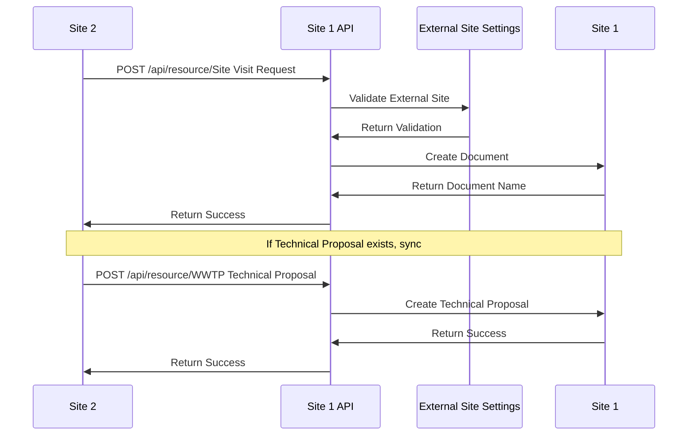

# Site 2 to Site 1 Integration

## Overview

This document describes the integration flow from Site 2 to Site 1, including recommended REST endpoints, field mappings, and error handling for bidirectional synchronization.

## Integration Sequence



## Recommended REST Endpoints

### Site Visit Request Endpoint
**URL**: `/api/resource/Site Visit Request`
**Method**: `POST`
**Purpose**: Create Site Visit Request on Site 1 from Site 2

### Technical Proposal Endpoint
**URL**: `/api/resource/WWTP Technical Proposal`
**Method**: `POST`
**Purpose**: Create Technical Proposal on Site 1 from Site 2

### File Upload Endpoint
**URL**: `/api/resource/File`
**Method**: `POST`
**Purpose**: Upload file attachments to Site 1

## Site Visit Request Sync (Site 2 → Site 1)

### Field Mapping Table

| Site 2 Field | Site 1 Field | Notes/Transform |
|--------------|--------------|-----------------|
| `lead` | `lead` | Direct mapping |
| `opportunity` | `opportunity` | Direct mapping |
| `site_visit_date` | `site_visit_date` | Date format conversion |
| `status` | `status` | Direct mapping |
| `source_document` | `source_document` | Set to Site 2 SVR name |
| `source_doctype` | `source_doctype` | Set to "Site Visit Request" |
| `notes` | `notes` | Add Site 2 reference |
| `priority` | `priority` | Direct mapping |
| `visit_type` | `visit_type` | Direct mapping |
| `visit_purpose` | `visit_purpose` | Direct mapping |
| `special_requirements` | `special_requirements` | Direct mapping |
| `equipment_needed` | `equipment_needed` | Direct mapping |
| `estimated_duration` | `estimated_duration` | Direct mapping |
| `follow_up_required` | `follow_up_required` | Direct mapping |

### API Payload Example

```json
{
  "doctype": "Site Visit Request",
  "lead": "LEAD-2024-00002",
  "opportunity": "OPP-2024-00002",
  "site_visit_date": "2024-01-20",
  "status": "Open",
  "source_document": "SVR-2024-00002",
  "source_doctype": "Site Visit Request",
  "notes": "Synced from Site 2 - Original SVR: SVR-2024-00002",
  "priority": "Medium",
  "visit_type": "Initial Assessment",
  "visit_purpose": "WWTP Technical Assessment for Domestic wastewater",
  "special_requirements": "Treatment Capacity: 200 m³/day; Available Footprint: 150 sqm",
  "equipment_needed": "Measuring tape, Camera, Notebook, Safety equipment, Water sampling bottles",
  "estimated_duration": "2-3 hours",
  "follow_up_required": 1
}
```

### Response Format

```json
{
  "data": {
    "name": "SVR-2024-00003",
    "owner": "Administrator",
    "creation": "2024-01-15 10:30:00",
    "modified": "2024-01-15 10:30:00",
    "modified_by": "Administrator",
    "docstatus": 0,
    "idx": 0,
    "lead": "LEAD-2024-00002",
    "opportunity": "OPP-2024-00002",
    "site_visit_date": "2024-01-20",
    "status": "Open"
  }
}
```

## Technical Proposal Sync (Site 2 → Site 1)

### Field Mapping Table

| Site 2 Field | Site 1 Field | Notes/Transform |
|--------------|--------------|-----------------|
| `lead` | `lead` | Direct mapping |
| `opportunity` | `opportunity` | Direct mapping |
| `wwtp_technical_questionnaire` | `wwtp_technical_questionnaire` | Direct mapping |
| `site_visit` | `site_visit` | Direct mapping |
| `water_sample` | `water_sample` | Direct mapping |
| `proposal_date` | `proposal_date` | Date format conversion |
| `valid_until` | `valid_until` | Date format conversion |
| `prepared_by` | `prepared_by` | Direct mapping |
| `technical_manager` | `technical_manager` | Direct mapping |
| `project_title` | `project_title` | Direct mapping |
| `project_description` | `project_description` | Direct mapping |
| `wastewater_generator_type` | `wastewater_generator_type` | Direct mapping |
| `design_capacity` | `design_capacity` | Direct mapping |
| `current_capacity` | `current_capacity` | Direct mapping |
| `treatment_technology` | `treatment_technology` | Direct mapping |
| `process_description` | `process_description` | Direct mapping |
| `treatment_stages` | `treatment_stages` | Direct mapping |
| `civil_requirements` | `civil_requirements` | Direct mapping |
| `site_preparation_needs` | `site_preparation_needs` | Direct mapping |
| `utility_connections` | `utility_connections` | Direct mapping |
| `operation_hours` | `operation_hours` | Direct mapping |
| `maintenance_requirements` | `maintenance_requirements` | Direct mapping |
| `chemical_consumption` | `chemical_consumption` | Direct mapping |
| `energy_consumption` | `energy_consumption` | Direct mapping |
| `environmental_permits_required` | `environmental_permits_required` | Direct mapping |
| `discharge_permit_status` | `discharge_permit_status` | Direct mapping |
| `environmental_monitoring` | `environmental_monitoring` | Direct mapping |
| `equipment_cost` | `equipment_cost` | Direct mapping |
| `civil_works_cost` | `civil_works_cost` | Direct mapping |
| `electrical_cost` | `electrical_cost` | Direct mapping |
| `total_project_cost` | `total_project_cost` | Direct mapping |
| `design_period` | `design_period` | Direct mapping |
| `procurement_period` | `procurement_period` | Direct mapping |
| `construction_period` | `construction_period` | Direct mapping |
| `commissioning_period` | `commissioning_period` | Direct mapping |
| `total_implementation_time` | `total_implementation_time` | Direct mapping |
| `technical_risks` | `technical_risks` | Direct mapping |
| `environmental_risks` | `environmental_risks` | Direct mapping |
| `mitigation_strategies` | `mitigation_strategies` | Direct mapping |
| `technical_recommendations` | `technical_recommendations` | Direct mapping |
| `next_steps` | `next_steps` | Direct mapping |
| `follow_up_required` | `follow_up_required` | Direct mapping |

## Idempotency and Duplicate Handling

### Idempotency Strategy
- **Unique Identifiers**: Use source document names as unique identifiers
- **Duplicate Detection**: Check for existing documents with same source
- **Update vs Create**: Update existing documents instead of creating duplicates
- **Status Tracking**: Track sync status to prevent duplicate operations

### Duplicate Handling Process
1. **Check Existence**: Check if document already exists on Site 1
2. **Source Validation**: Validate source document information
3. **Update or Create**: Update existing or create new document
4. **Status Update**: Update sync status accordingly

### Duplicate Detection Logic

```python
# Pseudo-code for duplicate detection
def handle_document_sync(payload):
    source_doc = payload.get('source_document')
    source_doctype = payload.get('source_doctype')
    
    # Check for existing document
    existing_doc = frappe.db.exists(
        'Site Visit Request',
        {
            'source_document': source_doc,
            'source_doctype': source_doctype
        }
    )
    
    if existing_doc:
        # Update existing document
        update_document(existing_doc, payload)
    else:
        # Create new document
        create_document(payload)
```

## Error Reporting and Retries

### Error Response Format

```json
{
  "message": "Error description",
  "exc_type": "ValidationError",
  "exc": "Detailed error information",
  "traceback": "Error traceback (if available)"
}
```

### Error Handling Process
1. **Error Detection**: Detect and categorize errors
2. **Error Logging**: Log error details for analysis
3. **Error Response**: Return appropriate error response
4. **Retry Information**: Provide retry guidance if applicable

### Common Error Scenarios

#### Validation Errors
- **Cause**: Field validation failures
- **Response**: Return validation error details
- **Action**: Provide specific field validation messages

#### Authentication Errors
- **Cause**: Invalid API credentials
- **Response**: Return authentication error
- **Action**: Request valid credentials

#### Permission Errors
- **Cause**: Insufficient permissions
- **Response**: Return permission error
- **Action**: Request appropriate permissions

#### Data Errors
- **Cause**: Invalid or missing data
- **Response**: Return data error details
- **Action**: Provide specific data requirements

## Security Considerations

### Authentication
- **API Key Validation**: Validate API Key and Secret
- **Permission Checks**: Verify user permissions for operations
- **Rate Limiting**: Implement rate limiting for API calls
- **Audit Logging**: Log all API access attempts

### Data Protection
- **Input Validation**: Validate all input data
- **SQL Injection Prevention**: Use parameterized queries
- **XSS Prevention**: Sanitize input data
- **Data Encryption**: Encrypt sensitive data

### Access Control
- **Role-based Access**: Implement role-based access control
- **Document Permissions**: Respect document-level permissions
- **Field Permissions**: Respect field-level permissions
- **Audit Trail**: Maintain complete audit trail

## Implementation Guidelines

### API Endpoint Implementation
1. **Authentication**: Implement API Key/Secret authentication
2. **Validation**: Implement comprehensive input validation
3. **Error Handling**: Implement robust error handling
4. **Response Format**: Use consistent response format
5. **Logging**: Implement comprehensive logging

### Data Processing
1. **Field Mapping**: Implement field mapping logic
2. **Data Transformation**: Transform data as needed
3. **Validation**: Validate data against business rules
4. **Storage**: Store data securely
5. **Status Tracking**: Track sync status

### Error Handling
1. **Error Detection**: Detect errors early
2. **Error Categorization**: Categorize errors appropriately
3. **Error Response**: Provide meaningful error responses
4. **Retry Guidance**: Provide retry guidance when applicable
5. **Logging**: Log all errors for analysis

## Testing and Validation

### Unit Testing
- **API Endpoints**: Test all API endpoints
- **Field Mappings**: Test field mapping logic
- **Error Handling**: Test error handling scenarios
- **Validation**: Test validation logic

### Integration Testing
- **End-to-End**: Test complete integration flow
- **Error Scenarios**: Test error scenarios
- **Performance**: Test performance under load
- **Security**: Test security measures

### Validation Testing
- **Data Integrity**: Validate data integrity
- **Field Validation**: Test field validation
- **Business Rules**: Test business rule validation
- **Permission Checks**: Test permission validation

## Monitoring and Maintenance

### Monitoring
- **API Performance**: Monitor API performance
- **Error Rates**: Monitor error rates
- **Usage Statistics**: Track usage statistics
- **Security Events**: Monitor security events

### Maintenance
- **Regular Updates**: Keep API endpoints updated
- **Security Updates**: Apply security updates
- **Performance Optimization**: Optimize performance
- **Error Analysis**: Analyze and address errors

### Best Practices
- **Documentation**: Maintain comprehensive documentation
- **Versioning**: Implement API versioning
- **Testing**: Regular testing and validation
- **Monitoring**: Continuous monitoring and alerting
