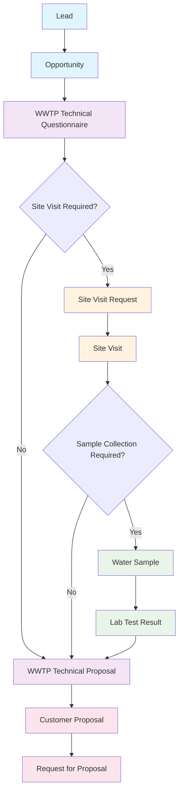

# Lead to Proposal Workflow

## Overview

This workflow covers the complete process from initial lead capture through customer proposal generation, including technical assessment, site visits, and proposal development.

## Workflow Diagram

## Step-by-Step Process

### 1. Lead Creation
**Purpose**: Initial contact capture
**Responsible**: Account Manager, Sales Team

**Steps**:
1. Navigate to CRM → Lead
2. Create new Lead with:
   - Company/Individual name
   - Contact information
   - Source and status
   - Notes about WWTP requirements
3. Save Lead

**Key Fields**:
- `company_name`: Company or individual name
- `email_id`: Primary contact email
- `mobile_no`: Contact phone number
- `source`: Lead source (Website, Referral, etc.)
- `status`: Lead status (Open, Qualified, etc.)

### 2. Opportunity Creation
**Purpose**: Qualified sales opportunity
**Responsible**: Account Manager

**Steps**:
1. Navigate to CRM → Opportunity
2. Create new Opportunity linked to Lead
3. Fill in opportunity details:
   - Expected project value
   - Expected closing date
   - Probability percentage
4. Save Opportunity

**Key Fields**:
- `party_name`: Link to Lead
- `opportunity_from`: Lead
- `expected_closing`: Expected closing date
- `probability`: Probability percentage
- `expected_value`: Expected project value

### 3. WWTP Technical Questionnaire
**Purpose**: Comprehensive technical assessment
**Responsible**: Site Manager, Technical Team

**Steps**:
1. Navigate to WT Operations → WWTP Technical Questionnaire
2. Create new questionnaire linked to Lead and Opportunity
3. Fill in basic information:
   - Wastewater generator type
   - Capacity requirements
   - Site conditions
4. Select effluent target type for auto-population
5. Complete technical specifications
6. Submit questionnaire

**Key Fields**:
- `lead`: Link to Lead
- `opportunity`: Link to Opportunity
- `wastewater_generator_type`: Type of wastewater source
- `capacity`: Treatment capacity (m³/day)
- `please_pick_the_target_effluent_type`: Effluent quality target
- `site_visit_required`: Flag for site visit
- `sample_collection_required`: Flag for sampling

**Auto-Population Features**:
- Effluent parameters based on target type
- Roles and responsibilities from Scope of Work
- Influent stream table based on number of streams

### 4. Site Visit Request (Optional)
**Purpose**: Formal site visit scheduling
**Responsible**: Site Manager

**Steps**:
1. From Technical Questionnaire, click "Create Site Visit Request"
2. Review auto-populated information
3. Set visit date and priority
4. Add special requirements
5. Submit Site Visit Request

**Key Fields**:
- `site_visit_date`: Planned visit date
- `priority`: Visit priority (Low, Medium, High, Urgent)
- `visit_type`: Type of visit
- `visit_purpose`: Purpose of visit
- `special_requirements`: Special requirements
- `equipment_needed`: Required equipment

**Cross-Site Integration**:
- Automatically creates external Site Visit Request if configured
- Syncs status and updates between sites

### 5. Site Visit
**Purpose**: On-site technical assessment
**Responsible**: Technical Team

**Steps**:
1. Navigate to WT Operations → Site Visit
2. Create new Site Visit linked to Site Visit Request
3. Use "Auto-fill from STP" button to populate data
4. Complete site assessment:
   - Site conditions
   - Existing equipment
   - Access and utilities
   - Environmental factors
5. Update visit status
6. Submit Site Visit

**Key Fields**:
- `site_visit_request`: Link to Site Visit Request
- `visit_date`: Actual visit date
- `visit_status`: Visit status
- `site_conditions`: Site condition assessment
- `existing_equipment`: Existing equipment inventory
- `access_utilities`: Access and utility assessment

### 6. Water Sample (Optional)
**Purpose**: Water quality analysis
**Responsible**: Technical Team

**Steps**:
1. Navigate to WT Operations → Water Sample
2. Create new Water Sample linked to Site Visit
3. Fill in sample details:
   - Sample collection date
   - Sample type and location
   - Collection method
4. Submit Water Sample

**Key Fields**:
- `site_visit`: Link to Site Visit
- `sample_date`: Collection date
- `sample_type`: Type of sample
- `collection_location`: Collection location
- `collection_method`: Collection method

### 7. Lab Test Result (Optional)
**Purpose**: Laboratory analysis results
**Responsible**: Lab Team

**Steps**:
1. Navigate to WT Operations → Lab Test Result
2. Create new Lab Test Result linked to Water Sample
3. Enter laboratory analysis results
4. Calculate compliance status
5. Submit Lab Test Result

**Key Fields**:
- `water_sample`: Link to Water Sample
- `test_date`: Test date
- `compliance_status`: Compliance status
- `test_parameters`: Test parameter results

### 8. WWTP Technical Proposal
**Purpose**: Technical solution document
**Responsible**: Technical Manager

**Steps**:
1. Navigate to WT Operations → WWTP Technical Proposal
2. Create new Technical Proposal linked to Technical Questionnaire
3. Use "Auto-fill from TQ" button to populate data
4. Complete technical specifications:
   - Treatment technology
   - Process description
   - Equipment specifications
   - Implementation timeline
5. Review and customize technical details
6. Submit Technical Proposal

**Key Fields**:
- `wwtp_technical_questionnaire`: Link to Technical Questionnaire
- `site_visit`: Link to Site Visit
- `water_sample`: Link to Water Sample
- `treatment_technology`: Selected treatment technology
- `process_description`: Process description
- `design_capacity`: Design capacity
- `implementation_timeline`: Implementation timeline

**Auto-Fill Features**:
- Project details from Technical Questionnaire
- Site conditions from Site Visit
- Water quality data from Lab Test Results
- Roles and responsibilities from Technical Questionnaire

### 9. Customer Proposal
**Purpose**: Commercial proposal with pricing
**Responsible**: Account Manager, Technical Manager

**Steps**:
1. Navigate to WT Operations → Customer Proposal
2. Create new Customer Proposal linked to Technical Proposal
3. Use "Auto-fill from Technical Proposal" button
4. Complete commercial details:
   - Customer information
   - Proposal validity
   - Commercial options (Supply & Installation, Design-Build, BOOT)
   - Pricing and terms
5. Review proposal completeness
6. Submit Customer Proposal

**Key Fields**:
- `customer`: Final customer
- `wwtp_technical_proposal`: Link to Technical Proposal
- `issue_date`: Proposal issue date
- `valid_up_to`: Proposal validity date
- `option_1_table`: Supply & Installation items
- `option_2_table`: Design-Build items
- `option_3_table`: BOOT items

**Commercial Options**:
- **Option 1**: Supply & Installation
- **Option 2**: Design-Build
- **Option 3**: BOOT (Build-Own-Operate-Transfer)

### 10. Request for Proposal (Optional)
**Purpose**: Formal RFP response
**Responsible**: Account Manager

**Steps**:
1. Navigate to WT Operations → Request for Proposal
2. Create new RFP linked to Customer Proposal
3. Complete RFP details:
   - RFP number and date
   - Submission deadline
   - Evaluation criteria
4. Submit RFP

**Key Fields**:
- `customer_proposal`: Link to Customer Proposal
- `rfp_number`: RFP reference number
- `rfp_date`: RFP date
- `submission_deadline`: Submission deadline
- `evaluation_criteria`: Evaluation criteria

## Workflow Variations

### Direct Technical Proposal
- Skip Site Visit Request and Site Visit steps
- Use Technical Questionnaire data only
- Suitable for standard projects

### Lab-First Approach
- Start with Water Sample collection
- Link to Site Visit or Technical Questionnaire later
- Suitable for existing facilities

### Ad-hoc Site Visit
- Create Site Visit Request independently
- Link to Technical Questionnaire later
- Suitable for emergency assessments

## Key Success Factors

### Data Quality
- Complete all required fields
- Use auto-fill functions for consistency
- Add comments for deviations
- Maintain proper document linkages

### Process Efficiency
- Use auto-population features
- Follow standardized workflows
- Leverage cross-site integration
- Monitor sync status

### Compliance
- Follow regulatory requirements
- Maintain audit trails
- Document all decisions
- Track compliance status

## Troubleshooting

### Common Issues
- **Missing auto-fill data**: Check document linkages
- **Sync failures**: Verify External Site Settings
- **Validation errors**: Review required fields
- **Permission issues**: Check user roles

### Best Practices
- Always link documents properly
- Use auto-fill buttons for consistency
- Complete required fields before submitting
- Monitor cross-site sync status
- Add comments for deviations
