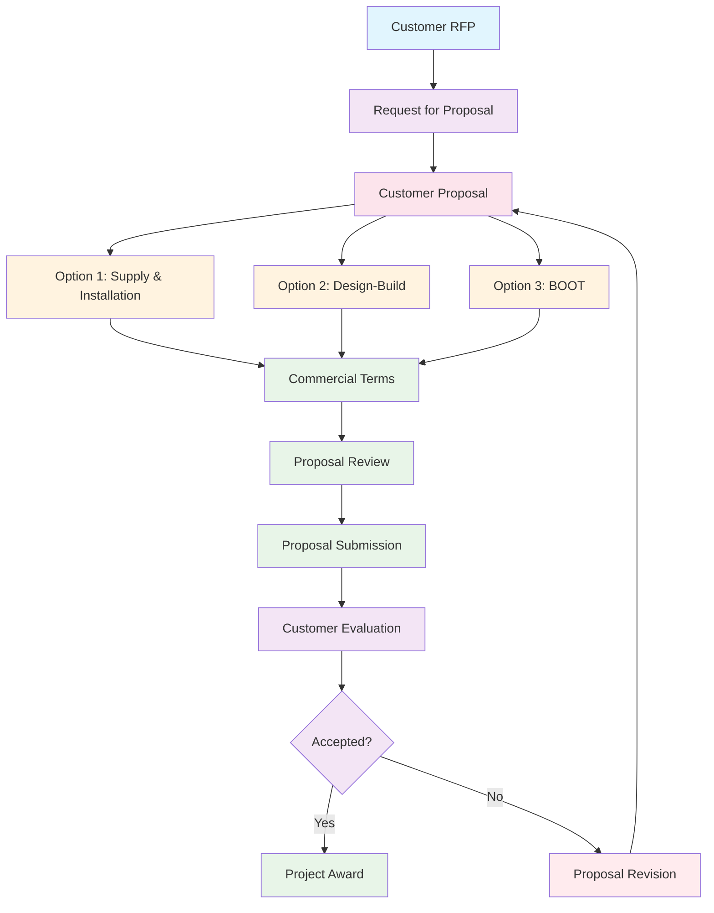

# RFP and Customer Proposal Workflow

## Overview

This workflow covers the process of responding to Request for Proposals (RFPs) and creating comprehensive customer proposals with multiple commercial options.

## Workflow Diagram

## Step-by-Step Process

### 1. Request for Proposal Creation
**Purpose**: Formal RFP response management
**Responsible**: Account Manager, Sales Team

**Steps**:
1. Navigate to WT Operations → Request for Proposal
2. Create new RFP with customer details:
   - Customer information
   - RFP reference number
   - Submission deadline
   - Evaluation criteria
3. Link to existing Customer Proposal if available
4. Set RFP status and priority
5. Submit RFP

**Key Fields**:
- `customer`: Customer organization
- `rfp_number`: RFP reference number
- `rfp_date`: RFP date
- `submission_deadline`: Submission deadline
- `evaluation_criteria`: Evaluation criteria
- `rfp_status`: RFP status (Open, Submitted, Awarded, Rejected)
- `priority`: Priority level
- `customer_proposal`: Link to Customer Proposal

### 2. Customer Proposal Creation
**Purpose**: Comprehensive commercial proposal
**Responsible**: Account Manager, Technical Manager

**Steps**:
1. Navigate to WT Operations → Customer Proposal
2. Create new Customer Proposal linked to Technical Proposal
3. Use "Auto-fill from Technical Proposal" button to populate data
4. Complete proposal details:

**Basic Information**:
- Customer and contact details
- Proposal validity period
- Account manager assignment
- Technical manager assignment

**Project Summary**:
- Project title and description
- Wastewater generator type
- Design and current capacity
- Treatment technology
- Process description

5. Submit Customer Proposal

**Key Fields**:
- `customer`: Final customer
- `customer_contact`: Customer contact person
- `wwtp_technical_proposal`: Link to Technical Proposal
- `issue_date`: Proposal issue date
- `valid_up_to`: Proposal validity date
- `account_manager`: Account manager
- `prepared_by`: Proposal preparer
- `technical_manager`: Technical manager

**Auto-Fill Features**:
- Project details from Technical Proposal
- Technical specifications
- Site conditions and requirements
- Implementation timeline
- Roles and responsibilities

### 3. Commercial Options Development
**Purpose**: Multiple commercial options for customer choice
**Responsible**: Account Manager, Commercial Team

#### Option 1: Supply & Installation
**Description**: Equipment supply and installation services

**Steps**:
1. Navigate to Option 1 section in Customer Proposal
2. Add equipment and services to `option_1_table`:
   - Treatment equipment
   - Installation services
   - Commissioning services
   - Training services
3. Set pricing for each item
4. Define terms and conditions

**Key Items**:
- Treatment equipment (tanks, pumps, controls)
- Installation services
- Commissioning services
- Training and documentation
- Warranty and support

#### Option 2: Design-Build
**Description**: Complete design and construction services

**Steps**:
1. Navigate to Option 2 section in Customer Proposal
2. Add design-build items to `option_2_table`:
   - Design services
   - Construction services
   - Equipment supply
   - Project management
3. Set pricing for each item
4. Define terms and conditions

**Key Items**:
- Design and engineering services
- Construction services
- Equipment supply
- Project management
- Commissioning and startup

#### Option 3: BOOT (Build-Own-Operate-Transfer)
**Description**: Build, own, operate, and transfer model

**Steps**:
1. Navigate to Option 3 section in Customer Proposal
2. Add BOOT items to `option_3_table`:
   - Construction services
   - Operation services
   - Maintenance services
   - Transfer terms
3. Set BOOT parameters:
   - Concession period
   - Operation period
   - Transfer terms
4. Define terms and conditions

**Key Items**:
- Construction services
- Operation and maintenance
- Performance guarantees
- Transfer terms
- Financial arrangements

**BOOT Validation Rules**:
- Operation period ≤ Concession period
- Transfer terms clearly defined
- Performance guarantees specified
- Financial arrangements documented

### 4. Terms and Conditions
**Purpose**: Define commercial terms and legal conditions
**Responsible**: Legal Team, Account Manager

**Steps**:
1. Complete terms and conditions for each option
2. Define payment terms and schedules
3. Specify warranty and support terms
4. Include liability and insurance requirements
5. Define change order procedures
6. Specify dispute resolution process

**Key Terms**:
- Payment terms and schedules
- Warranty periods and coverage
- Support and maintenance
- Liability and insurance
- Change order procedures
- Dispute resolution

### 5. Proposal Review and Approval
**Purpose**: Internal review and approval process
**Responsible**: Management Team

**Steps**:
1. Technical review by Technical Manager
2. Commercial review by Account Manager
3. Legal review by Legal Team
4. Management approval
5. Final proposal preparation
6. Proposal submission

**Review Criteria**:
- Technical accuracy and completeness
- Commercial competitiveness
- Legal compliance
- Risk assessment
- Profitability analysis

### 6. Proposal Submission
**Purpose**: Submit proposal to customer
**Responsible**: Account Manager

**Steps**:
1. Prepare final proposal documents
2. Generate proposal summary
3. Submit proposal to customer
4. Track submission status
5. Follow up with customer
6. Handle customer questions

**Submission Requirements**:
- Complete proposal documents
- Technical specifications
- Commercial terms
- Legal conditions
- Supporting documentation

### 7. Customer Evaluation and Response
**Purpose**: Handle customer evaluation and response
**Responsible**: Account Manager

**Steps**:
1. Monitor customer evaluation process
2. Respond to customer questions
3. Provide additional information
4. Handle clarification requests
5. Participate in customer meetings
6. Track evaluation status

**Customer Interaction**:
- Technical clarifications
- Commercial negotiations
- Legal discussions
- Site visits and meetings
- Reference checks

### 8. Proposal Revision (If Required)
**Purpose**: Revise proposal based on customer feedback
**Responsible**: Account Manager, Technical Manager

**Steps**:
1. Analyze customer feedback
2. Identify required changes
3. Revise technical specifications
4. Adjust commercial terms
5. Update legal conditions
6. Resubmit revised proposal

**Revision Types**:
- Technical modifications
- Commercial adjustments
- Legal condition changes
- Scope modifications
- Timeline adjustments

## Commercial Options Comparison

### Option 1: Supply & Installation
**Advantages**:
- Lower upfront cost
- Customer retains control
- Faster implementation
- Lower risk

**Disadvantages**:
- Customer responsible for operation
- Limited ongoing support
- Higher long-term costs
- Customer expertise required

### Option 2: Design-Build
**Advantages**:
- Single point of responsibility
- Faster project delivery
- Cost certainty
- Integrated design and construction

**Disadvantages**:
- Higher upfront cost
- Less customer control
- Vendor dependency
- Limited flexibility

### Option 3: BOOT
**Advantages**:
- No upfront investment
- Guaranteed performance
- Ongoing support
- Risk transfer to vendor

**Disadvantages**:
- Higher long-term cost
- Vendor dependency
- Limited control
- Complex contract terms

## Key Success Factors

### Technical Excellence
- Accurate technical specifications
- Proven technology selection
- Proper equipment sizing
- Compliance with regulations

### Commercial Competitiveness
- Competitive pricing
- Flexible payment terms
- Comprehensive warranty
- Value-added services

### Legal Compliance
- Clear terms and conditions
- Proper risk allocation
- Compliance with regulations
- Dispute resolution procedures

### Customer Relationship
- Understanding customer needs
- Responsive communication
- Professional presentation
- Ongoing support

## Troubleshooting

### Common Issues

**Technical Specification Errors**
- Review technical requirements
- Verify equipment specifications
- Check compliance requirements
- Validate calculations

**Commercial Pricing Issues**
- Review cost estimates
- Check market rates
- Verify profit margins
- Adjust pricing strategy

**Legal Compliance Problems**
- Review legal requirements
- Check contract terms
- Verify insurance coverage
- Update legal conditions

**Customer Communication Issues**
- Improve communication processes
- Provide timely responses
- Clarify requirements
- Maintain professional relationships

### Best Practices

**Proposal Preparation**
- Start early
- Use templates
- Review thoroughly
- Get approvals

**Customer Interaction**
- Be responsive
- Provide clear information
- Maintain professionalism
- Follow up regularly

**Documentation**
- Maintain accurate records
- Track all communications
- Document decisions
- Keep versions current

**Quality Control**
- Review all documents
- Check calculations
- Verify compliance
- Get approvals
