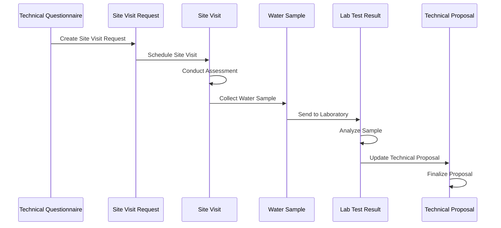

# Site Visit and Sampling Workflow

## Overview

This workflow covers the complete process of conducting site visits, collecting water samples, and managing laboratory test results for WWTP projects.

## Workflow Diagram

## Step-by-Step Process

### 1. Site Visit Request Creation
**Purpose**: Formal request for site visit
**Responsible**: Site Manager, Technical Team

**Steps**:
1. From WWTP Technical Questionnaire, click "Create Site Visit Request"
2. Review auto-populated information:
   - Lead and opportunity details
   - Project requirements
   - Special requirements
   - Equipment needed
3. Set visit details:
   - Visit date and time
   - Priority level
   - Visit type
   - Estimated duration
4. Add additional requirements if needed
5. Submit Site Visit Request

**Key Fields**:
- `lead`: Link to Lead
- `opportunity`: Link to Opportunity
- `technical_questionnaire`: Link to Technical Questionnaire
- `site_visit_date`: Planned visit date
- `priority`: Visit priority (Low, Medium, High, Urgent)
- `visit_type`: Type of visit (Initial Assessment, Technical Survey, Follow-up)
- `visit_purpose`: Purpose of visit
- `special_requirements`: Special requirements
- `equipment_needed`: Required equipment
- `estimated_duration`: Estimated visit duration

**Auto-Population Features**:
- Lead and opportunity details
- Project requirements from Technical Questionnaire
- Special requirements based on generator type
- Equipment list based on requirements
- Visit purpose and type

### 2. Site Visit Scheduling
**Purpose**: Schedule and coordinate site visit
**Responsible**: Site Manager, Technical Team

**Steps**:
1. Review Site Visit Request details
2. Coordinate with customer for visit scheduling
3. Assign technical team members
4. Prepare equipment and materials
5. Update visit status to "Scheduled"

**Key Considerations**:
- Customer availability
- Technical team availability
- Equipment requirements
- Weather conditions
- Access permissions

### 3. Site Visit Execution
**Purpose**: On-site technical assessment
**Responsible**: Technical Team

**Steps**:
1. Navigate to WT Operations → Site Visit
2. Create new Site Visit linked to Site Visit Request
3. Use "Auto-fill from STP" button to populate data
4. Complete site assessment:

**Site Conditions Assessment**:
- Site accessibility and layout
- Existing infrastructure
- Utility connections
- Environmental conditions
- Safety considerations

**Equipment Inventory**:
- Existing tanks and equipment
- Pump systems
- Control systems
- Electrical infrastructure
- Instrumentation

**Technical Measurements**:
- Flow rates and patterns
- Water quality parameters
- Operating conditions
- Maintenance requirements
- Performance issues

5. Document findings and recommendations
6. Update visit status to "Completed"
7. Submit Site Visit

**Key Fields**:
- `site_visit_request`: Link to Site Visit Request
- `visit_date`: Actual visit date
- `visit_status`: Visit status
- `site_conditions`: Site condition assessment
- `existing_equipment`: Existing equipment inventory
- `access_utilities`: Access and utility assessment
- `environmental_factors`: Environmental factors
- `safety_considerations`: Safety considerations
- `recommendations`: Technical recommendations

### 4. Water Sample Collection (Optional)
**Purpose**: Collect water samples for laboratory analysis
**Responsible**: Technical Team

**Steps**:
1. Navigate to WT Operations → Water Sample
2. Create new Water Sample linked to Site Visit
3. Fill in sample details:

**Sample Information**:
- Sample collection date and time
- Sample type and location
- Collection method
- Sample volume
- Preservation requirements

**Collection Details**:
- Sampling point location
- Collection method
- Sample containers
- Preservation chemicals
- Chain of custody

4. Document collection process
5. Submit Water Sample

**Key Fields**:
- `site_visit`: Link to Site Visit
- `sample_date`: Collection date
- `sample_type`: Type of sample (Influent, Effluent, Process)
- `collection_location`: Collection location
- `collection_method`: Collection method
- `sample_volume`: Sample volume
- `preservation_requirements`: Preservation requirements
- `chain_of_custody`: Chain of custody information

### 5. Laboratory Analysis
**Purpose**: Analyze water samples for quality parameters
**Responsible**: Laboratory Team

**Steps**:
1. Navigate to WT Operations → Lab Test Result
2. Create new Lab Test Result linked to Water Sample
3. Enter laboratory analysis results:

**Physical Parameters**:
- pH
- Temperature
- Turbidity
- Total Suspended Solids (TSS)
- Total Dissolved Solids (TDS)

**Chemical Parameters**:
- Biochemical Oxygen Demand (BOD5)
- Chemical Oxygen Demand (COD)
- Oil and Grease
- Nutrients (Nitrogen, Phosphorus)
- Heavy metals

**Biological Parameters**:
- E. coli
- Total Coliform
- Helminth eggs
- Pathogens

4. Calculate compliance status
5. Generate test report
6. Submit Lab Test Result

**Key Fields**:
- `water_sample`: Link to Water Sample
- `test_date`: Test date
- `compliance_status`: Compliance status
- `test_parameters`: Test parameter results
- `test_methods`: Test methods used
- `quality_control`: Quality control measures
- `test_report`: Test report reference

### 6. Results Integration
**Purpose**: Integrate lab results into technical proposal
**Responsible**: Technical Manager

**Steps**:
1. Review Lab Test Result findings
2. Update Technical Proposal with lab data
3. Adjust treatment recommendations based on results
4. Update compliance assessment
5. Finalize technical specifications

**Integration Points**:
- Influent quality characteristics
- Effluent quality requirements
- Treatment process selection
- Equipment sizing
- Compliance considerations

## Workflow Variations

### Standard Site Visit
- Complete site assessment
- Document findings
- No sample collection required
- Suitable for preliminary assessments

### Comprehensive Assessment
- Complete site assessment
- Collect water samples
- Laboratory analysis
- Detailed technical recommendations
- Suitable for detailed design projects

### Follow-up Visit
- Focus on specific issues
- Verify previous recommendations
- Collect additional samples if needed
- Suitable for project monitoring

### Emergency Assessment
- Rapid response required
- Focus on critical issues
- Immediate recommendations
- Suitable for emergency situations

## Quality Control Measures

### Site Visit Quality
- Standardized assessment forms
- Photo documentation
- Multiple team members
- Peer review process
- Customer confirmation

### Sample Collection Quality
- Proper sampling techniques
- Chain of custody procedures
- Sample preservation
- Quality control samples
- Documentation requirements

### Laboratory Quality
- Accredited laboratory
- Standard test methods
- Quality control samples
- Proficiency testing
- Audit trail maintenance

## Cross-Site Integration

### Site Visit Request Sync
- Automatic creation on external site
- Status synchronization
- Update tracking
- Error handling

### Sample Data Sharing
- Lab results sharing
- Compliance status updates
- Technical recommendations
- Report distribution

## Troubleshooting

### Common Issues

**Site Access Problems**
- Coordinate with customer
- Obtain necessary permissions
- Plan alternative access routes
- Document access issues

**Sample Collection Issues**
- Follow proper procedures
- Use appropriate containers
- Maintain chain of custody
- Document deviations

**Laboratory Delays**
- Plan for lead times
- Coordinate with lab schedule
- Track sample status
- Communicate delays

**Data Integration Problems**
- Verify data accuracy
- Check field mappings
- Review calculations
- Validate results

### Best Practices

**Site Visit Preparation**
- Review project requirements
- Prepare equipment checklist
- Coordinate with team
- Plan visit logistics

**Sample Collection**
- Follow standard procedures
- Maintain chain of custody
- Document collection process
- Ensure sample integrity

**Data Management**
- Verify data accuracy
- Maintain audit trails
- Update related documents
- Track compliance status

**Communication**
- Keep stakeholders informed
- Document findings clearly
- Provide timely updates
- Address issues promptly
